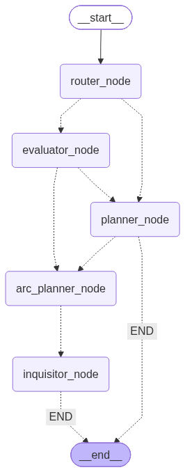

# LG Tutor

A Socratic tutor built on LangGraph. Instead of lecturing, it walks a student through short "discovery arcs" — a few conversational beats that go from observation to the student explaining the idea in their own words, with the formal term revealed at the end. Runs as a FastAPI backend with SQLite-checkpointed threads, fronted by an OpenWebUI pipe.

The included curriculum covers phishing (typosquatting, homograph attacks, social engineering, dangerous attachments). The curriculum is just data in `core/api.py` — replace `overall_goal` and `learning_outcomes` to teach something else.



## How it works

Each student message is one pass through the graph. State is checkpointed per `thread_id`, so lessons resume across sessions.

First turn: `router → planner → arc_planner → inquisitor`. Later turns: `router → evaluator`, which routes back through `arc_planner → inquisitor` to continue, or through `planner` when a topic finishes (or the curriculum ends).

### Nodes (`core/nodes.py`)

- **router** — no LLM. Fresh thread goes to planner, ongoing lesson to evaluator.
- **planner** — no LLM. Rebuilds remaining topics from the curriculum minus completed ones and loads the current topic's outcomes.
- **arc_planner** (`gpt-5-mini`) — generates a 2–4 beat discovery arc for the current outcome. Skips the LLM call if a valid arc already exists.
- **inquisitor** (`gpt-4.1-mini`) — the tutor the student actually talks to. Executes one beat per turn, steered by the evaluator's latest monologue. Only its tokens are streamed to the client.
- **evaluator** (`gpt-5-mini`) — grades the student's last answer against the current beat and writes the monologue that steers the inquisitor's next turn.

### Arcs

Each learning outcome becomes an arc of beats: present a concrete artifact and ask for an observation, narrow in on the key detail, then have the student explain the mechanism themselves. If the outcome has a real term of art, Python appends a final reveal beat where the tutor names the concept. Every beat carries a `(Cleared by: ...)` grading key the evaluator judges against; the inquisitor is forbidden from leaking it.

### Evaluation

The evaluator outputs one of: `ADVANCE` (beat cleared — gist counts, doubt isn't penalized), `REMEDIATE` (lost or confidently wrong — hint ladder, not the answer), `NO_ATTEMPT` (greeting/meta-comment — re-ask), or `MOVE_ON` (student asked to skip).

The model only decides; Python owns state:

- A rich answer can clear several beats at once (`satisfied_upcoming`), but never past the reveal beat.
- Three failed remediations in a row, or `MOVE_ON`, triggers a concession: the tutor just teaches the answer and moves on.
- Any student question gets prepended to the monologue as a "answer this first" directive.
- The formal term is regex-masked out of everything the inquisitor sees until the reveal beat is next.
- The student's exact words are appended to every monologue so the tutor can't fabricate what they said.
- Failed API calls leave progress untouched — the student resends and continues.

### State (`core/state.py`)

`AgentState` holds the message history, the latest evaluator monologue, the curriculum (`learning_outcomes`), topic/outcome progress lists, the current arc and its withheld term, and a remediation counter. Topics are stored reversed so the current one is `remaining_topics[-1]`.

## Layout

```
core/
  graph.py            graph assembly; renders graph.png
  state.py            AgentState
  nodes.py            nodes, prompts, state logic
  models.py           structured-output schemas (Evaluation, ArcPlan)
  api.py              FastAPI server + curriculum
  openwebui_pipe.py   OpenWebUI Function (frontend)
  cli_test.py         interactive terminal client
  persona_test.py     scripted-persona smoke test
  llm_student_test.py LLM-simulated student test
```

## Running

Requires Python 3.12, Poetry, and an OpenAI key.

```bash
poetry install
cp .env.example .env   # set OPENAI_API_KEY; TUTOR_API_KEY optional
cd core
uvicorn api:app --port 8000
```

- `POST /chat` — `{"message", "thread_id"}` → streams the reply as plain text. Needs an `X-API-Key` header if `TUTOR_API_KEY` is set.
- `GET /health` — readiness check.

Reuse a `thread_id` to resume. The DB path is `THREADS_DB_PATH` (default `threads.db`).

Tests: `python core/cli_test.py` for an interactive session, `persona_test.py` / `llm_student_test.py` for scripted and LLM-simulated students (results land in the repo root).

### Docker

```bash
cp .env.example .env   # set OPENAI_API_KEY
docker compose up -d --build
docker compose logs -f lg-tutor-api   # watch startup; /health should report ok
```

The image installs deps via Poetry, runs uvicorn from `core/`, and stores `threads.db` at `/data` on the `tutor_data` volume, so student progress survives rebuilds. Config comes from `.env` (`OPENAI_API_KEY`, optional `TUTOR_API_KEY`) plus `THREADS_DB_PATH` set in the compose file.

Note the compose file publishes **no ports** by design — the API is only reachable from containers on `tutor-net`. To hit it directly during testing, either add a `ports: ["8000:8000"]` mapping temporarily, or exec in:

```bash
docker compose exec lg-tutor-api python -c \
  "import urllib.request; print(urllib.request.urlopen('http://localhost:8000/health').read())"
```

### OpenWebUI integration

`docker-compose.yml` is written to join an existing OpenWebUI stack: merge the service/network/volume in (see comments in the file), add `tutor-net` to the open-webui service, then paste `core/openwebui_pipe.py` into OpenWebUI → Admin Panel → Functions. Alternatively keep the files separate and mark `tutor-net` external (`docker network create tutor-net`, then declare it external in both compose files).

### The OpenWebUI pipe

`core/openwebui_pipe.py` is an OpenWebUI Function that registers "LG Tutor" in the model picker and bridges chats to the backend's `/chat` endpoint. What it does:

- **Thread mapping** — thread_id is `user_id:chat_id`, so each chat is its own resumable lesson and two users can't collide. Falls back to hashing the first message if OpenWebUI omits `chat_id`.
- **Newest message only** — the graph is stateful, so the pipe sends just the latest user message, not OpenWebUI's replayed history.
- **Background-task guard** — OpenWebUI routes title/tag generation to the chat's model; the pipe short-circuits these (`__task__`) so they never hit the graph and advance lesson state.
- **Status indicator** — shows "Reading your answer..." during the evaluator/arc-planner dead air, cleared when the first token streams in.
- **Valves** — backend URL, `X-API-Key` secret, timeout, and status text are configurable from the UI.

The file in the repo is the source of truth; re-paste it into OpenWebUI after edits.

**Future work:** the backend speaks a custom `/chat` protocol (plain-text stream, custom payload), which is why this glue pipe exists at all. At some point it should expose an OpenAI-compatible endpoint (`/v1/chat/completions` with SSE chunks) instead — then OpenWebUI could connect to it as a standard OpenAI connection with no Function to install or re-paste, and any other OpenAI-compatible client would work too. The main design question is thread mapping: the OpenAI API is stateless, so the thread_id would need to come from a header or model-name convention rather than the request body.

## Changing models

Each node builds its own `ChatOpenAI` in `core/nodes.py`. The arc planner and evaluator need structured-output support.
